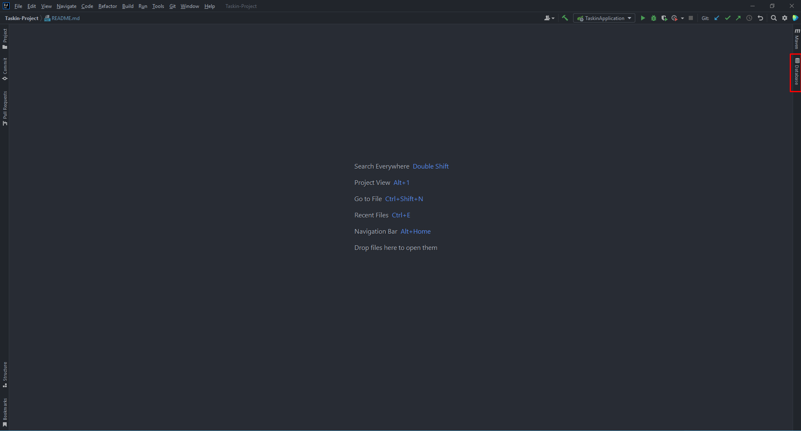
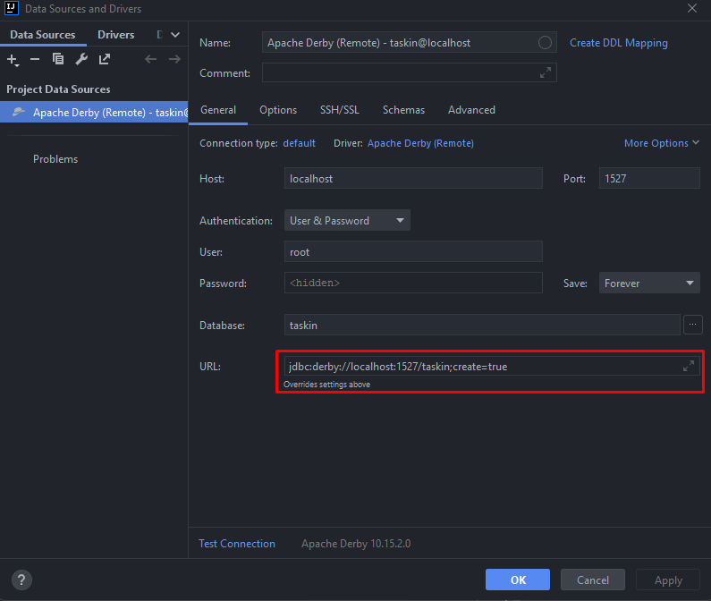

# Taskin Project
This is the repository for Project of CS393 Developing Backend Applications with Spring Framework course given by [Esma Meral](https://github.com/esmameral) at [Ozyegin University](https://www.ozyegin.edu.tr).
Code is written by [Esad Simitcioglu](https://github.com/EsadSimitcioglu), [Emin Sadikhov](https://github.com/SadikhovEmin) and [Abdullah Saydemir](https://github.com/Saydemr) and will be available after the deadline via [this link](https://github.com/EsadSimitcioglu/Taskin-Project).
 
### Pre-requisites
- [Java SE 11](https://www.oracle.com/tr/java/technologies/javase/jdk11-archive-downloads.html)
- [IntelliJ IDEA](https://www.jetbrains.com/idea/download)
- [Derby DB v10.15.2.0](https://db.apache.org/derby/derby_downloads.html)
    - Download the `db-derby-10.15.2.0-bin.zip` archive (`db-derby-10.15.2.0-bin.tar.gz` if you are using Unix/Linux) from the link above.
    - Run the server by double-clicking on `startNetworkServer.bat` file inside `bin` directory. You can use `.jar` file with the similar name if you downloaded the `.tar.gz` version.
- [Postman](https://www.postman.com/downloads/)
- Maven (available through IntelliJ IDEA)
   
### Configurations
- To connect IntelliJ IDEA to Derby DB:
    - Click `Database` tab in the top-right corner of the IDE.       
    - Click `+  -> Data Source` and choose `Apache Derby` from the dropdown menu.
    - From drivers tab choose `Apache Derby (Remote)` and download the ClientDriver. Then click on `Create Data Source`.
    - Adjust the configurations according to below image.
      
    - Click on `Apply` and `OK`.
    - You can now use the query console and tables directly from IntelliJ IDEA.
       

### Adding Records to DB
- `data.sql` file will be configured to initialize the database with the specific instances after db initialization.
   

### Running the Code
- Assuming you have already extracted the zip file since this file is open, find `gradle.build` inside the `Taskin-Project` directory and run it.
- Navigate to `src/main/java/com/example/Taskin` and run `TaskinApplication.java` with IntelliJ IDEA.

 

### REST Services
- All REST service implementations according to the [Project Specification](./CS393_Project.pdf) are available through the Controller.

 

### Swagger Documentation
- API docs are available from [here](http://localhost:8080/api-docs)
- Swagger UI is available from [here](http://localhost:8080/swagger-ui-taskin.html)

### Class Diagram
- Class diagram is available from [resources directory](./src/main/resources)